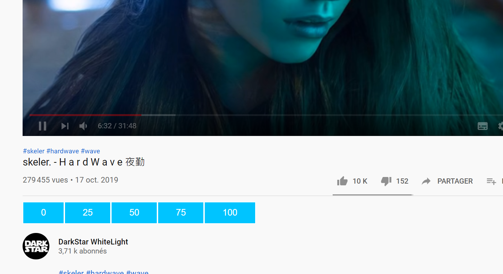

# browser-extension-datacollection
This extension add a rating system that feed a google sheet.
the goal is to collect rating data on how "clikbait" or "toxic" a video is.

- vote 100 if it is a toxic video such as "Top 10 prank gone sexual".
- vote 0 if it is a "normal" video.

here is the [data](https://docs.google.com/spreadsheets/d/10T3lIOc5fZgsyvmYeWOlmgsaRiGI2BhYNBPY5YH0EFk/edit?usp=sharing) so far :

